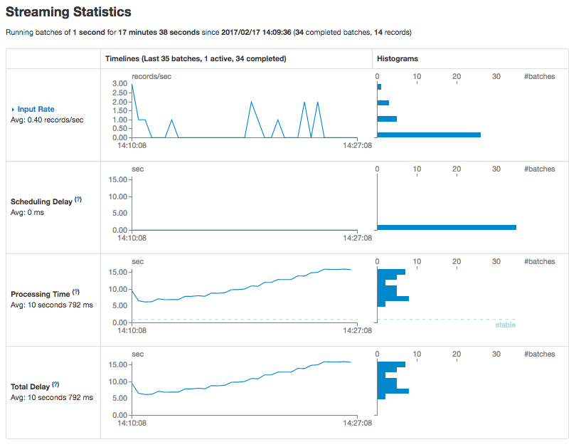

## Spark/Kafka/Twitter Stream playground

### Requirements:
  - You need docker and docker-compose installed and running
  - [Create a Twitter app](https://apps.twitter.com/) and get some twitter creds. 

### Installation:

  - `run bin/spark_setup` - This ensures you have the [gettyimages/docker-spark](https://github.com/gettyimages/docker-spark) 
    repo cloned locally, as docker-compose needs some stuff from here.
  - Copy the `twitter.creds.env.tmpl` to `twitter.creds.env`, and fill in your twitter creds
  - Set the topic(s) you want to follow in the `docker-compose.yml` `twitter_stream` service (`TWEET_TOPICS` environment variable)

### Running things:

  - `bin/kafka-print-tweets` will stream Trump-related tweets (sent from python to kafka).
  - `bin/spark-twitter-stream [number_of_workers (default=1)]` will spin up the cluster and run `spark/scripts/tweet_consumer.py`

### Performance tuning

While running `bin/spark-twitter-stream`, you can monitor performance at [localhost:4040](http://localhost:4040). 
If the stream window gets overloaded with tweets, you may start to see scheduling delays on the [streaming tab](http://localhost:4040/streaming/).

Basically, you want to remain in healthy system usage (you can monitor via docker stats), while having your stream batch process time
stay below your sliding window time so that you don't get behind the stream.

You can tune your stream performance with the following levers:

  - Add or remove workers (using `docker-compose scale worker=N`)
    - Note that each worker gets 1GB of memory, and docker-compose does seem to allow you to 
      allocate more workers/memory than your machine may be capable of. If you overdo this, 
      you could overload your machine depending on the hardware you're using.
    - You may see a spike in batch processing while workers are shuffling loads, but adding more workers 
      _should_ ultimately lower processing time (as long as your system can handle it).

  - Adjust the number of minutes the window is open (in `spark.env`)
    - This keeps a lid on how many tweets you are processing at any given time.

  - Adjust the number of seconds the window slides by (in `spark.env`)
    - If it is taking longer to process each batch than this value,
      expanding it will give the stream more time to catch its breath between batches.

On a `t2.xlarge` ec2 instance (4 cores, 16GB memory), processing the topic 'trump', I have found that the following works well:

  - 15 minutes window 
  - 30 second sliding
  - 3 workers
  
At the time of writing this, the stream window averages ~40,000 tweets 
once it is up to speed, and takes about 15 seconds to clean the text, get a word list, and get polarity basic stats. 
Since batches process every 30 seconds, this leaves plenty of headroom to add more complicated processing steps.

Whatever your topic(s) and/or settings, you'll want to stress test this by running it longer than your total window,
and looking for the streaming processing time to level off while your system usage remains at healthy levels.

### Notes:
- If your twitter stream is returning 401 errors (and your creds are correct), 
  you may need to restart your docker engine. At least on OSX, the container's system time can drift 
  if the computer goes to sleep, and this violates Twitter's Stream API need for system time to be accurate.

- If adding new supplementary jars in `spark/jars` or adding new requirements to `spark/requirements.txt`,
  you need to rebuild the spark master and worker images, as the build process copies jars/installs python 
  packages in all necessary containers.

